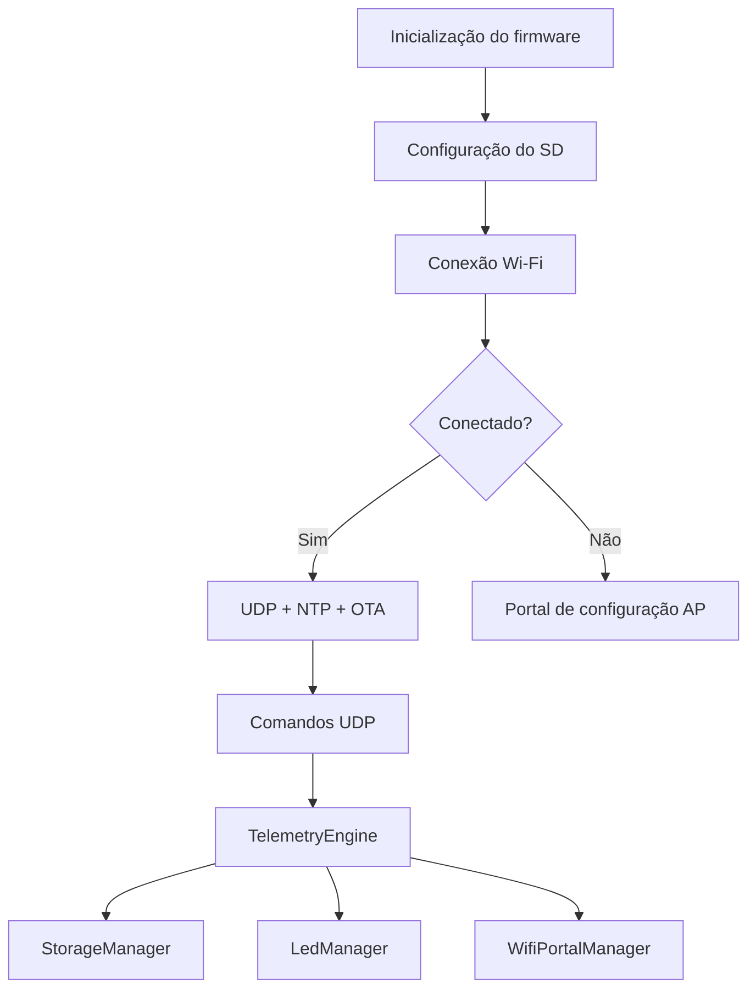

# Arquitetura do projeto

## Visão geral

O firmware do ESP32 Octopus foi organizado em módulos com responsabilidades bem separadas para facilitar manutenção, depuração e extensão.

## Fluxo de execução

## Componentes

### `defines.h`

Mantém as constantes globais do projeto, principalmente pinos usados na placa e limites de fila, timeout e parâmetros de rede.

### `StorageManager`

Responsável por:

- inicializar o cartão SD;
- criar e rotacionar logs;
- ler arquivos para serial;
- remover e verificar arquivos;
- garantir que o sistema continue funcionando mesmo quando o cartão falha.

### `WifiPortalManager`

Responsável por:

- conectar em STA com credenciais salvas;
- iniciar AP de configuração quando necessário;
- processar HTTP para salvar parâmetros;
- escutar e responder UDP;
- armazenar configurações em `Preferences`.

### `LedManager`

Cuida do comportamento visual do dispositivo para: 

- sinal de conexão;
- heartbeat;
- piscadas controladas por comando;
- feedback ao usuário durante keep-alive e reset.

### `TelemetryEngine`

É o núcleo lógico de diagnóstico e resposta. A partir do texto recebido em UDP, ele executa ações como:

- `TEMP`
- `CPU`
- `NET_INFO`
- `UPTIME`
- `LED_ON`, `LED_OFF`, `LED_BLINK`
- `RESET_WIFI`

### `NTPService`

Sincroniza a hora do sistema usando NTP e compartilha a hora com o restante do firmware.

## Observações

Para hardware real, é importante validar:

- GPIO usados em cada placa;
- nível lógico dos LEDs;
- polaridade do botão de reset;
- qualidade do módulo de cartão SD;
- alimentação estável da ESP32.
